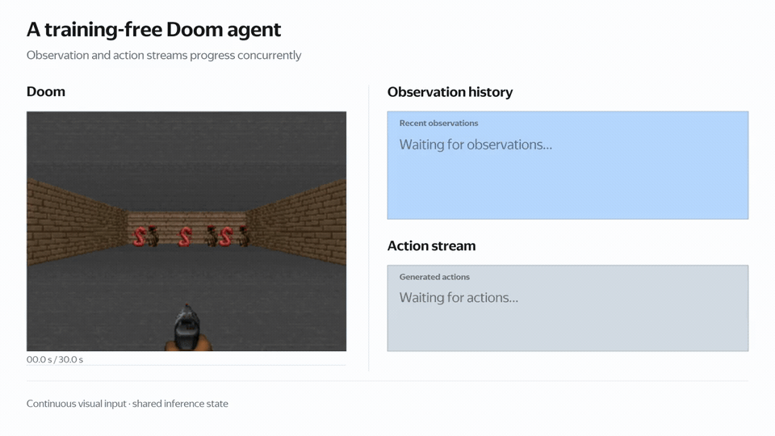

# AsyncLLM: LLMs are General Asynchronous Agents

Official implementation of the paper `LLMs are General Asynchronous Agents`.

AsyncLLM lets you build **training-free asynchronous LLM agents** with Python's `async`/`await`.
An agent is a set of asyncio coroutines that run LLM inference at the same time. Each coroutine
writes to its own **`CacheBlock`** and sees the other coroutines' progress in real time through
**cache views**. This lets one model listen while it thinks, react to streaming video or logs, and
split work across parallel sub-agents, with no task-specific training.

- **Programming model:** coroutines, cache blocks, and cache views, coordinated with ordinary
  `asyncio` primitives (`Event`, `Lock`, `Queue`, ...).
- **Shared-memory inference:** a forward pass can attend to any ordered list of cache blocks. This
  works for full attention, Gated DeltaNet, and multimodal (MRoPE) layers, so hybrid and vision
  Qwen 3.5+ models are supported.
- **Inference engine:** requests from all coroutines are gathered and run as balanced batches.
  The engine is built on [Mini-SGLang](https://github.com/sgl-project/mini-sglang).

---

## Demo
<div align="center">
  <picture>
  
  </picture>
  <br>
  <div align="center" width="80%">
  <em>An LLM agent playing Doom with concurrent streams over a shared cache.</em>
  </div>
  <br>
</div>

## Installation

Linux + NVIDIA GPU only; we build against CUDA 13.0. We recommend [`uv`](https://docs.astral.sh/uv/):

```bash
uv venv --python=3.12 && source .venv/bin/activate
uv pip install -e ".[dev]"
```

Some kernels are JIT-compiled, so make sure the CUDA Toolkit (`nvcc`) matches your driver.
You can also use the provided [`Dockerfile`](./Dockerfile).

## Example: think and speak at the same time

A "thinker" coroutine reasons in the background. After each finished paragraph, a "writer" gives
the user a one-line summary. The writer's view includes the thinker's block, so it reads the
reasoning directly from shared memory. The thinker's view leaves out the writer's block, so it is
not distracted by the summaries.

```python
import asyncio, torch
from minisgl.llm import AsyncLLM
from minisgl.shared_cache import AsyncContext

PROMPT = "<|im_start|>user\nWhat is 17 * 23?<|im_end|>\n<|im_start|>assistant\n"

async def main():
    api = AsyncLLM("Qwen/Qwen3.5-9B", dtype=torch.bfloat16, memory_ratio=0.9)
    encode = lambda text: api.tokenizer.encode(text, add_special_tokens=False)
    prompt_block, thinker_block, writer_block = [await api.create_block() for _ in range(3)]
    paragraph_finished = asyncio.Event()  # thinker -> writer synchronization

    await api.forward(encode(PROMPT), write_to=prompt_block)  # prefill the prompt

    async def generate(prefix, cache_view, stop, max_steps=1024):
        """Feed `prefix`, then decode into the last block of `cache_view` until `stop`."""
        ids = encode(prefix)
        if len(ids) > 1:
            await api.forward(ids[:-1], cache_view=cache_view)
        ctx = AsyncContext(cache_view=cache_view)
        async for token_id in api.async_generate(ctx, first_token_id=ids[-1], max_steps=max_steps):
            token = api.tokenizer.decode(token_id)
            yield token
            if stop in token:
                break

    async def thinker_coro():
        try:
            async for token in generate("<think>\n", [prompt_block, thinker_block], stop="</think>"):
                if "\n\n" in token:
                    paragraph_finished.set()  # notify the writer
        finally:
            paragraph_finished.set()

    think_in_background = asyncio.create_task(thinker_coro())
    while not think_in_background.done():
        await paragraph_finished.wait()  # wait for background thoughts
        paragraph_finished.clear()
        async for token in generate(
            "...</think> Summary:", [prompt_block, thinker_block, writer_block], stop="\n"
        ):  # the writer sees the thinker's block as it grows
            print(token, end="", flush=True)

    await api.close()

asyncio.run(main())
```

Both coroutines are batched into the same forward passes automatically. For custom scaffolding,
`api.forward(...)` (or `await api(...)`) runs a single pass that returns raw logits. Depending on
its arguments, it prefills a block, runs one decode step, or runs a prefill conditioned on a view.
`api.sample(...)` samples from logits with the model's generation config. You can use it for
probes, e.g. reading the next-token distribution over a fixed set of actions.

## Demos

**Asynchronous thinking:** thinker and writer streams with a mode-switching probe, ported from the
[AsyncReasoning demo](https://github.com/yandex-research/AsyncReasoning/blob/main/notebooks/demo_async_thoughts.ipynb):
[__`scripts/async_thoughts`__](./scripts/async_thoughts)

```bash
uv pip install -e scripts/async_thoughts
async-thoughts --problem "What is 17 * 23?"
async-thoughts --model /path/to/Qwen3.5-0.8B --max-steps 140 --probe-period 20   # quick demo
```

**TODO: asynchronous Doom agent (background thinker + fast action probe)**

## Cite

If you found this work useful, please consider citing:

```
@misc{yakushev2026llmsgeneralasynchronousagents,
      title={LLMs are General Asynchronous Agents},
      author={George Yakushev and Denis Mazur and Vladimir Bartenev and Vyacheslav Zhdanovskiy and Timofey Byzov and Vladimir Kaurkin and Vadim Pastushenko},
      year={2026},
      eprint={TODO},
      archivePrefix={arXiv},
      primaryClass={cs.LG},
      url={TODO},
}
```
