# Image and text shards
Pic 1 is erroneous; pic 2 is the original corrected source, both normalized.

## MathVista 45

| Pic 1 | Pic 2 |
|---|---|
| 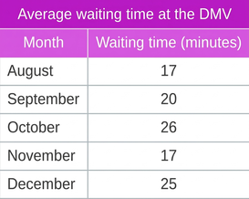 | 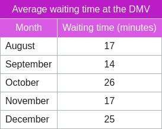 |

Text shard 1: An administrator at the Department of Motor Vehicles (DMV) tracked the average wait time from month to month. According to the table, what was the rate of change between August and September? (Unit: minutes per month)

Text shard 2: The earlier picture contained an error. It has now been corrected. Recheck your reasoning using the current picture.

## MathVista 331

| Pic 1 | Pic 2 |
|---|---|
| 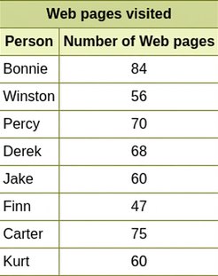 | 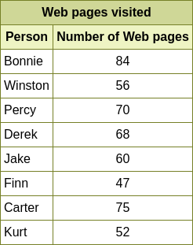 |

Text shard 1: Several people compared how many Web pages they had visited. What is the mean of the numbers?'

Text shard 2: The earlier picture contained an error. It has now been corrected. Recheck your reasoning using the current picture.

## MathVista 234

| Pic 1 | Pic 2 |
|---|---|
| 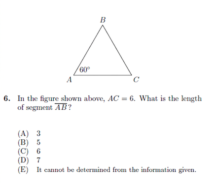 | 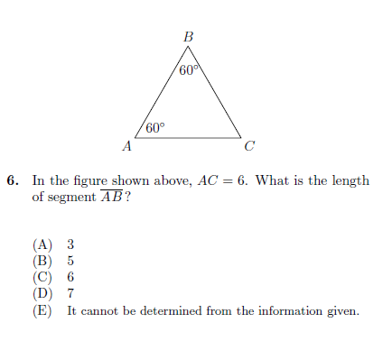 |

Text shard 1: In the figure shown above, AC = 6. What is the length of segment AB?
Choices:
(A) 3
(B) 5
(C) 6
(D) 7
(E) It cannot be determined from the information given

Text shard 2: The earlier picture contained an error. It has now been corrected. Recheck your reasoning using the current picture.

## MathVista 206

| Pic 1 | Pic 2 |
|---|---|
| 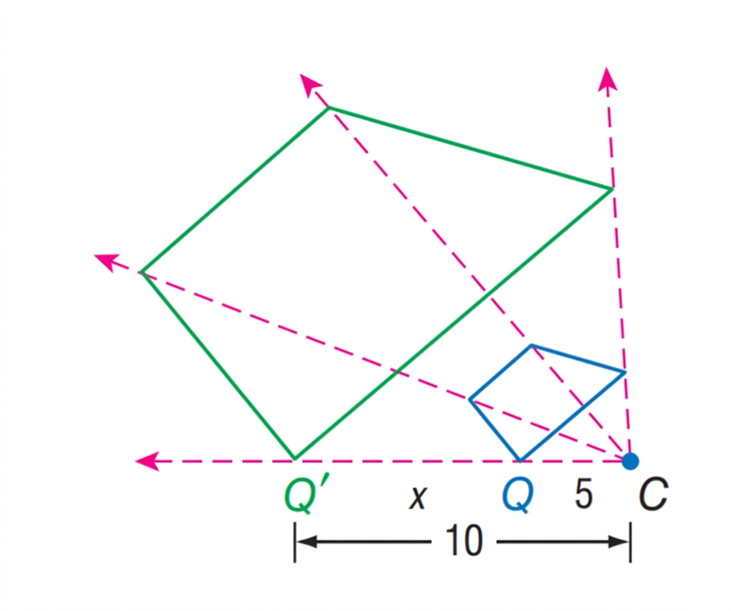 | 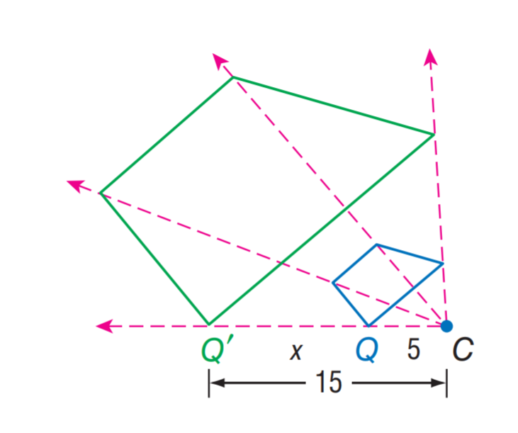 |

Text shard 1: Find the scale factor from $Q$ to $Q'$.
Choices:
(A) 2
(B) 3
(C) 4
(D) 5

Text shard 2: The earlier picture contained an error. It has now been corrected. Recheck your reasoning using the current picture.

## MathVista 926

| Pic 1 | Pic 2 |
|---|---|
| 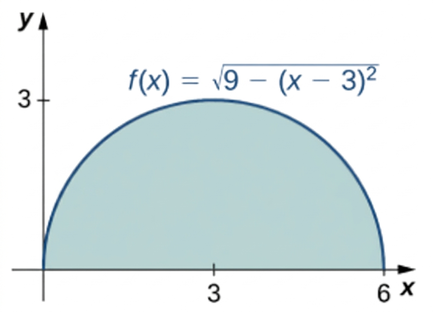 | 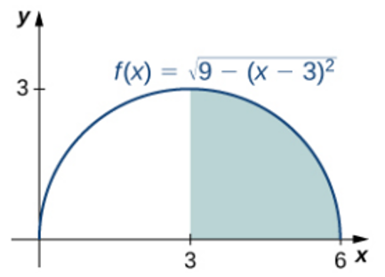 |

Text shard 1: What is the size of the shaded area under the curve? Round the answer to 2 decimal places
Decimal places: 2.

Text shard 2: The earlier picture contained an error. It has now been corrected. Recheck your reasoning using the current picture.

## MathVista 88

| Pic 1 | Pic 2 |
|---|---|
| 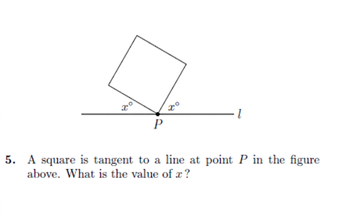 | 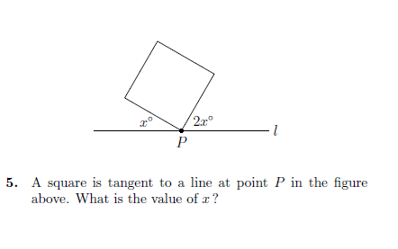 |

Text shard 1: A square is tangent to a line at point P in the figure above. What is the value of x?

Text shard 2: The earlier picture contained an error. It has now been corrected. Recheck your reasoning using the current picture.
